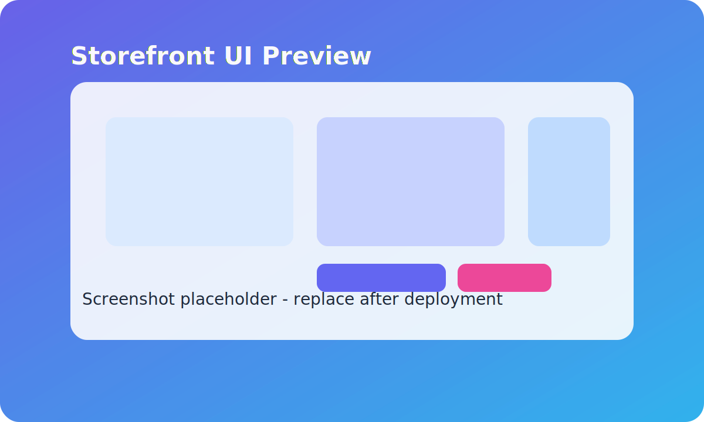

# 🛒 Online Shopping Cart (GitHub + Codex Cloud Only)

## 1. Overview
This project is an **Online Shopping Cart** web application designed to run fully on **GitHub + Codex Cloud**.  
No local development is required. All code will be generated, updated, and maintained by **Codex Cloud Agent**.  

- **Frontend**: React + Vite  
- **Backend**: Node.js + Express  
- **Database**: MongoDB (cloud-based, e.g. MongoDB Atlas)  
- **Storage**: Local `/uploads` folder or cloud storage (e.g. Cloudinary, S3)  
- **Target Users**: Retail customers (frontend) and Admins (backend).  

---

## 2. Project Workflow
1. Update this `README.md` with new requirements (Features, Roadmap, or Agent Notes).  
2. Run **Codex Cloud Agent (Full Access)**.  
3. Agent will:  
   - Read this file  
   - Generate/update code in this repo  
   - Commit and push changes automatically  
4. Deploy to cloud platform (Vercel for frontend, Render/Railway for backend).  

---

## 3. Environment
Environment variables will be stored on **cloud deployment platforms** only.

> **Important:** Until database persistence is wired up, `DATABASE_URL` is optional. When it is omitted the API runs with in-memory
> data only, and the startup checks emit a warning instead of blocking the boot process. Provide a valid connection string once
> you are ready to integrate MongoDB (or another backing store).

To re-enable the strict requirement after the database is connected:

1. Set `DATABASE_URL` in your deployment environment (or local `.env`).
2. Update `server/src/config/env.ts` so `databaseUrl` once again calls `requireEnv('DATABASE_URL')`.
3. Adjust the `env:DATABASE_URL` check in `server/src/config/runtimeChecks.ts` to treat a missing value as a failure.

Example `.env.example` file (committed to repo for reference):
PORT=3000
DATABASE_URL=mongodb+srv://<user>:<pass>@cluster.mongodb.net/shopping_cart # Optional until persistence is enabled
JWT_SECRET=change-me
ADMIN_USERNAME=change-me
ADMIN_PASSWORD=change-me
UPLOAD_DIR=uploads

⚠️ Do not commit `.env` files with real secrets.
Use **Vercel / Render / Railway / Codex Cloud Project Settings** to configure actual values.

### Secure configuration & rotation checklist

The server automatically boots even if `JWT_SECRET`, `ADMIN_USERNAME`, or `ADMIN_PASSWORD` are missing, but it falls back to development defaults and disables admin login until secure values are configured. Set `ALLOW_DEVELOPMENT_FALLBACKS=false` (or provide all three secrets) to enforce strict startup checks. Follow the checklist below for every environment:

1. **Generate strong values**
   - JWT secret: `openssl rand -hex 64` (or an equivalent 64+ character random string generator).
   - Admin username: choose a non-default account name unique to your deployment.
   - Admin password: generate a high-entropy password (e.g. `pwgen -sy 32 1` or a password manager).
2. **Store the credentials** only inside the hosting provider's secret manager / environment configuration UI.
3. **Deploy** after confirming the variables are present. Startup checks will fail the deploy if any of the required values are
   missing.
4. **Rotate regularly**:
   - Schedule recurring reminders (e.g. quarterly) to regenerate all three values.
   - Update the hosting provider's environment variables with the new values.
   - Restart or redeploy the backend so the new configuration is loaded.
   - Invalidate previously issued admin JWTs by logging out or waiting for the configured expiration (one hour by default).
5. **Emergency rotation**: if compromise is suspected, immediately replace the values, redeploy, and review audit logs for
   suspicious activity.

For the Vite frontend, copy `client/.env.example` to `client/.env` and set `VITE_API_BASE_URL` to your backend URL (defaults to `http://localhost:3000/api`).

### Temporarily allowing development fallbacks in production

If you need to bring the API online before the production secrets are ready (for example, while validating a new hosting environment), simply deploy without the admin secrets. The API will use development defaults, disable admin login, and emit warnings reminding you to finish the secure setup. When you are ready to enforce strict checks again, either configure the real secrets or set `ALLOW_DEVELOPMENT_FALLBACKS=false` to block startup until they are present.

---

## 4. Project Structure
The structure is managed entirely by **Codex Cloud Agent**.  
Expected layout:  

/client # Frontend (React + Vite)
/server # Backend (Node.js + Express)
/tests # Automated tests
README.md

---

## 5. Features (User Stories)
- [x] Customer: Browse products with images, name, price  
- [x] Customer: Add/remove/update items in cart  
- [x] Customer: Checkout flow (address + payment placeholder)  
- [ ] Admin: Login/Logout with JWT  
- [ ] Admin: Add/Edit/Delete products  
- [ ] Admin: Upload product images  
- [ ] System: Store data in MongoDB Atlas  
- [x] System: Responsive UI (mobile + desktop)  

---

## 6. Definition of Done ✅
- Frontend and backend code live inside this repository.  
- Customer flow (browse → add to cart → checkout) is functional.  
- Admin flow (login → manage products → upload image) is functional.  
- Database integrated (MongoDB Atlas).  
- Tests added for backend API.  
- Code formatted with ESLint + Prettier.  

---

## 7. Agent Notes
- You are an AI agent running in **Codex Cloud Full Access mode**.  
- Your responsibilities:  
  - Generate TypeScript code for both frontend and backend  
  - Create API routes under `/server/routes/`  
  - Create React components under `/client/components/`  
  - Implement JWT authentication for admin routes  
  - Use `multer` for image uploads (saved in `/server/uploads/`)  
  - Write tests in `/tests/` folder  
  - Update this `README.md` when features are added/changed  
- Commit messages must follow **Conventional Commits** (e.g. `feat: add product CRUD API`).
- 禁止建立分支，請直接 commit main
- 🚫 禁止建立 PR，請直接 commit 到 main。

---

## 8. Frontend Preview (Placeholder)

---

## 9. Roadmap
- [ ] Deploy frontend to Vercel (connected to `client/`)
- [ ] Deploy backend to Render or Railway (connected to `server/`)
- [ ] Add Stripe/PayPal payment integration
- [ ] Add order history for customers
- [ ] Add product categories and search
- [ ] Add analytics dashboard for admin

---

## 10. Vercel Troubleshooting
- **Direct route navigation returns 404**
  - Confirm the Vercel project root is set to the `client/` directory so `client/vercel.json` is discovered during builds.
  - The config contains a catch-all rewrite (`/(.*) → /index.html`) that ensures `/admin` and other client-side routes serve the SPA instead of Vercel's 404 page.
  - If the project root cannot be changed, copy the rewrite config to a `vercel.json` at the repository root and redeploy.
- **General deployment checklist**
  - Run `npm run build` inside `client/` locally or in CI to catch build errors before deploying to Vercel.
  - Ensure `VITE_API_BASE_URL` in `client/.env` points to the live backend URL (e.g. Render or Railway) before triggering a production build.
  - Verify environment variables and rewrites after every framework upgrade, because Vercel may require a clean redeploy for the changes to apply.

---

## 11. Render Troubleshooting
- **Accessing logs after a failed deploy**
  - Open the service in the [Render Dashboard](https://dashboard.render.com/), select the failing deploy from the **Events** tab, and inspect the real-time logs at the bottom of the page.
  - Alternatively install the [Render CLI](https://render.com/docs/render-cli) and run `render login`, then fetch logs with `render logs --service <service-id> --tail` to stream the most recent output from the instance.
  - For historical context or sharing with support, append `--since 30m` (or another window) to pull logs from the specified time range.
- **Log contents**: The backend emits structured startup diagnostics and captures `uncaughtException` / `unhandledRejection` events, so all fatal setup errors appear in the Render log stream.

---
